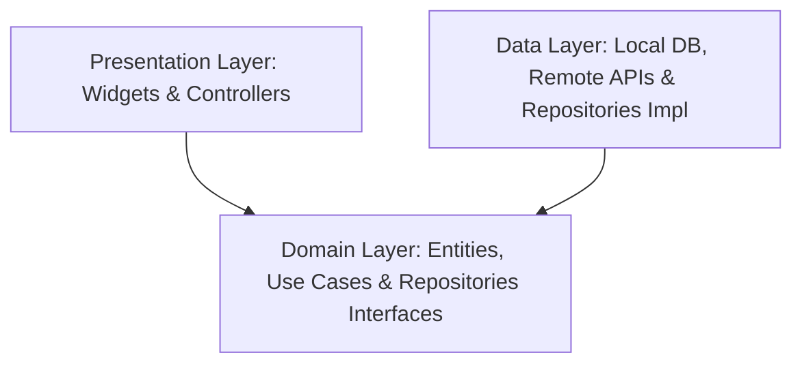

# Architecture Guide — Voyanta AI

This document establishes the architecture for Voyanta AI. It acts as the single source of truth for the codebase architecture.

---

## 1. Architectural Philosophy

Voyanta AI is built on a **Clean Architecture** framework combined with a **Feature-First Modular** directory structure. This ensures the application is:
- **Testable**: Domain business logic can be tested in isolation without UI, databases, network servers, or any external elements.
- **Independent of UI**: The UI can be swapped or modified easily (e.g., swapping a component library or migrating from mobile-only to desktop/web) without changing the core business rules.
- **Independent of Database**: SQL database, local caches, and remote APIs are treated as plugins, decoupled from the core business logic.
- **Scalable**: Modularity prevents code from becoming a monolith as team size and feature sets grow.

---

## 2. Structural Layers

The system is separated into three distinct boundaries with a strict dependency rule: **Dependencies point inward. Inner layers have no knowledge of outer layers.**



### A. Presentation Layer (Outer Layer)
Contains the UI components (Widgets, Screens, Pages), state controllers, and state notifications.
- **Responsibility**: Observe state changes, present layouts, intercept user gestures, and delegate execution to the domain layer (Use Cases).
- **Technology**: Flutter Widgets, Riverpod/Bloc state handlers.

### B. Domain Layer (Core Layer)
Contains the business logic and core rules of the application. It is pure Dart/Typescript, completely decoupled from external libraries.
- **Entities**: Business objects (e.g., `Trip`, `Itinerary`, `Expense`, `User`).
- **Use Cases**: Interactions/processes (e.g., `GenerateItinerary`, `SyncOfflineExpenses`, `CalculateTripBudget`).
- **Repository Interfaces**: Abstract contracts defining how data is saved or retrieved, implemented by the Data layer.

### C. Data Layer (Outer Layer)
Handles retrieval and modification of data from remote servers (Supabase, Gemini API) and local persistence caches (Isar, Hive).
- **Data Models**: Subclasses of Entities containing serialization logic (e.g., `fromJson()`, `toMap()`, `toPostgres()`).
- **Data Sources**: Low-level database handlers (`LocalDataSource`, `RemoteDataSource`).
- **Repository Implementations**: Implementations of Domain Repository Interfaces that orchestrate network-first, cache-fallback logic.

---

## 3. Core Design Patterns

### Repository Pattern
Decouples domain logic from database schemas and REST clients. The domain use case requests data through an interface contract. The repository implementation decides whether to query the local SQLite/Isar cache or make an API request to Supabase.

```
Use Case ──> Repository Interface (Domain)
                  ▲
                  │ (Implements)
             Repository Impl (Data) ──> Local Storage (Isar)
                                    ──> Remote API (Supabase)
```

### Service Layer Pattern
Used for wrapping complex third-party system interactions that do not belong to entities or databases, such as:
- `AIService` (Gemini model API interface)
- `MapService` (Mapbox rendering and pathfinding wrappers)
- `LocationService` (GPS system integrations)

---

## 4. Architectural Rules & SOLID Compliance

1. **Single Responsibility Principle (SRP)**: Each class (e.g., use case, controller, repository) must have exactly one reason to change. Do not bundle syncing logic and display logic in the same class.
2. **Open/Closed Principle (OCP)**: Code must be open for extension but closed for modification. Use interfaces for services (e.g., `WeatherService`) so that if we migrate from Open-Meteo to OpenWeatherMap, we write a new implementation class without touching use cases.
3. **Liskov Substitution Principle (LSP)**: Subclasses must be substitutable for their superclasses. Data models must behave exactly like domain entities.
4. **Interface Segregation Principle (ISP)**: Clients should not be forced to depend on methods they do not use. Separate repositories into small, dedicated contracts (`ItineraryRepository`, `ExpenseRepository` instead of a single `DatabaseRepository`).
5. **Dependency Inversion Principle (DIP)**: High-level modules must not depend on low-level modules; both must depend on abstractions. UI depends on Repository contracts, not concrete Data Sources. We resolve dependencies using dependency injection (e.g., Riverpod providers or Service Locators).
