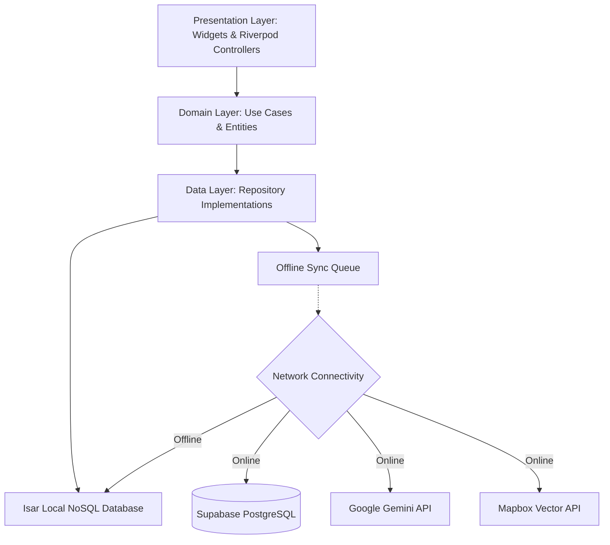
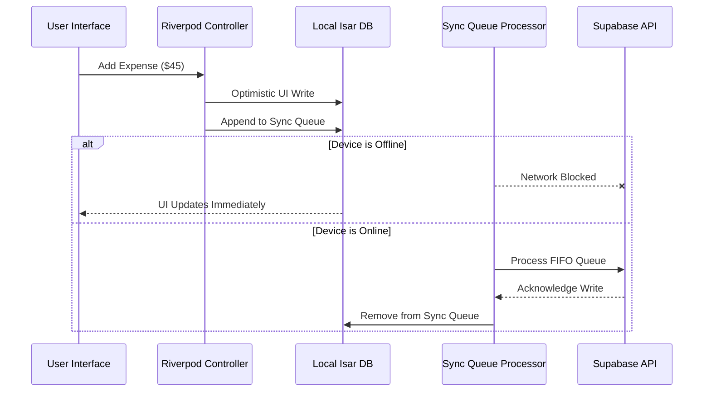
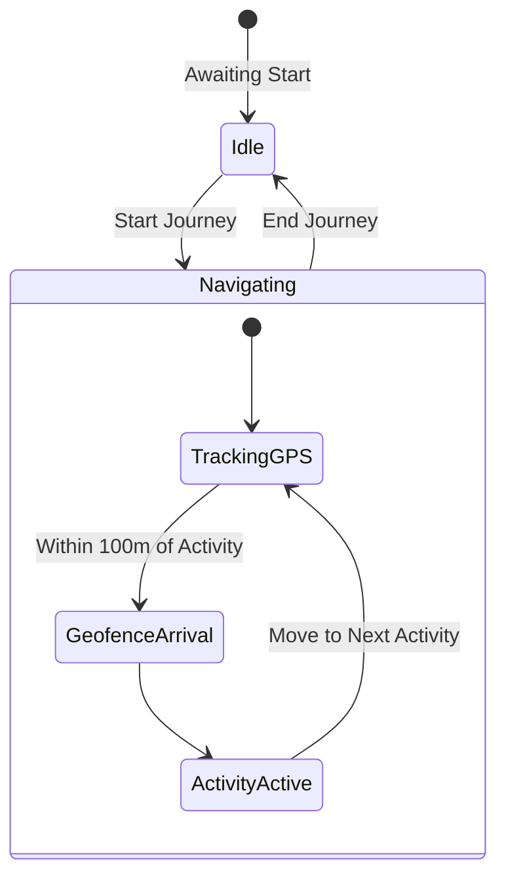
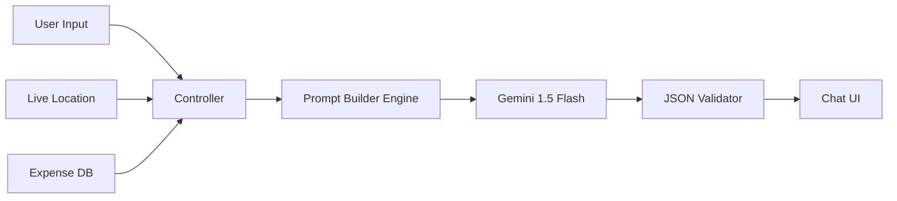

# Architecture Diagrams — Voyanta AI

This document contains visual Mermaid.js representations of the core technical workflows inside Voyanta AI.

## 1. Overall System Architecture
Voyanta AI uses a Clean Architecture combined with a highly modular Feature-First layout.

## 2. The Offline Sync Engine
The most complex part of Voyanta AI is ensuring data durability when traveling without cellular networks.

## 3. The Live Journey Engine
The journey engine tracks GPS coordinates and geofences to orchestrate the travel timeline.

## 4. AI Orchestration Pipeline
The AI Companion seamlessly feeds local context (location, budget) to Gemini to generate proactive recommendations.

