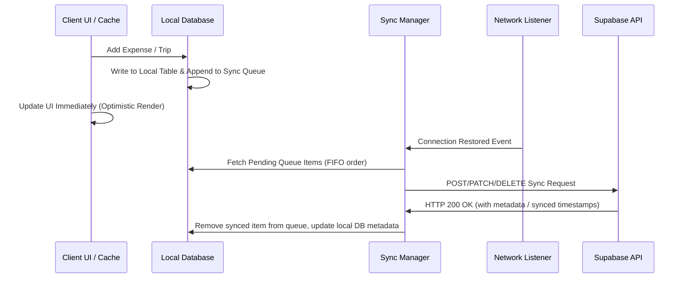

# System Design Guide — Voyanta AI

This document details the systems design, offline-first mechanisms, caching strategy, and integration layers of Voyanta AI.

---

## 1. High-Level Flow Diagram

The diagram below visualizes the data flow from the client application through repositories to local storage and remote networks.

```
+-------------------------------------------------------------+
|                     PRESENTATION LAYER                      |
|           UI Widgets  <--->  Riverpod States/Blocs          |
+-------------------------------------------------------------+
                               |
                               | (Calls Use Cases)
                               v
+-------------------------------------------------------------+
|                        DOMAIN LAYER                         |
|         Use Cases  <--->  Repository Interfaces (Contracts)  |
+-------------------------------------------------------------+
                               |
                               | (Implements Interface)
                               v
+-------------------------------------------------------------+
|                         DATA LAYER                          |
|                  Repository Implementations                 |
+-------------------------------------------------------------+
              /                                   \
             / (Queries / Saves)                   \ (Network Requests)
            v                                       v
+-----------------------+              +--------------------------+
|      LOCAL CACHE      |              |      REMOTE SYSTEMS      |
|    Isar Database      |              |  Supabase Database (REST)|
|    Secure Storage     |              |  Google Gemini API       |
+-----------------------+              |  Open-Meteo API          |
                                       |  Mapbox Vector Maps API  |
                                       +--------------------------+
```

---

## 2. Offline-First Synchronization Loop

Voyanta AI operates fully offline. Users can create trips, edit itineraries, log expenses, and read existing data when completely disconnected from cellular or WiFi networks.

### Synchronous Writes (Local)
When a database update occurs:
1. The model is saved to the local **Isar database** immediately.
2. A synchronization job is appended to the local **Sync Queue table**.
3. UI state updates instantly from the local database, providing a fast interface experience.

### Asynchronous Sync Queue (Remote)
A background system monitors connectivity changes and triggers synchronization:



---

## 3. Conflict Resolution System

If changes are made on multiple devices, the conflict engine uses **Last-Write-Wins (LWW)** with a fallback **Merge Strategy** for structured records:

| Scenario | Resolution Rule | Action |
|---|---|---|
| **Independent creation** | Additive | Records are combined into local database. |
| **Simultaneous modification** | Last-Write-Wins (LWW) | Compare `updated_at` timestamps; the most recent timestamp is persisted. |
| **Delete vs Modify** | Delete priority | If a record was deleted on one device and modified on another, it is removed, unless modified timestamp is significantly newer. |
| **Expense logging** | Additive | Expenses are strictly appended to prevent total balance mismatch. |

---

## 4. Architectural Boundaries

- **Database Separation**: Direct SQL commands or client initializations (e.g., Supabase client calls) must never cross into the presentation layers or domain entities. They remain isolated behind `RemoteDataSource` boundaries.
- **Strict DTO Mapping**: Remote payloads are converted to Data Transfer Objects (DTOs) first, validation is applied, and then they are mapped to pure Domain Entities. The UI works only with Domain Entities to prevent model modifications from breaking widget render trees.
