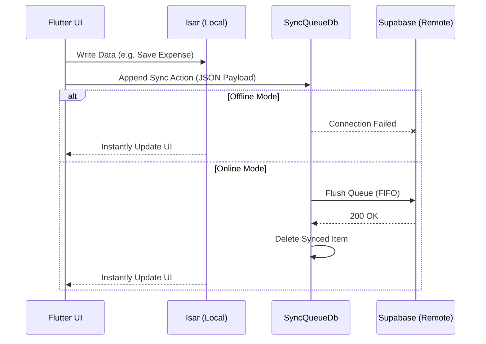

# Offline Strategy — Voyanta AI

This document details the offline-first engineering specifications, local database synchronization pipelines, and conflict management engine for Voyanta AI.

---

## 1. Network Connectivity Listener

The client monitors connectivity states continuously:
- **Connection Hook**: A listener observes connection updates:
  ```dart
  // Connectivity hook implementation skeleton
  connectivity.onConnectivityChanged.listen((status) {
    if (status == ConnectivityResult.wifi || status == ConnectivityResult.mobile) {
      // Trigger background synchronization queue execution
      syncQueueManager.processPendingQueue();
    }
  });
  ```
- **Network Guards**: All remote HTTP requests are intercepted by a network pre-check wrapper. If the client is offline, requests are aborted early without network timeout blocks, reverting immediately to local cached data sources.

---

## 2. Synchronization Queue Engine



Every write operation (creates, edits, deletes) is processed in two local steps:

### A. Local DB Persistence
Data is updated immediately in the local Isar database, ensuring instant UI rendering updates.

### B. Sync Queue Registration
A log record is appended to the local `SyncQueue` table:

```dart
@collection
class SyncQueueItem {
  Id? id;
  String tableName; // e.g., 'expenses', 'trips'
  String recordId;  // UUID of the affected row
  String action;    // 'CREATE', 'UPDATE', or 'DELETE'
  String payload;   // Serialized JSON delta representing changes
  DateTime createdAt;
}
```

---

## 3. Queue Processor Loop

When connectivity is detected:
1. The `SyncQueueManager` retrieves all pending items sorted by `createdAt` ascending (First-In, First-Out).
2. It processes items sequentially. For each item:
   - Makes a REST call to Supabase.
   - On success: deletes the queue item from the local DB.
   - On server failure (e.g., validation issue): moves the item to a `DeadLetterQueue` for user review to prevent blocking the remaining sync stream.
   - On connection interruption: stops the loop immediately and waits for the next network status update.

---

## 4. Conflict Resolution Details

- **Last-Write-Wins (LWW)**: Supabase tables include an `updated_at` column. When merging data from the client, the database updates the record only if the incoming payload's `updated_at` timestamp is newer than the database's current value.
- **Bi-directional Sync**: Upon connection recovery, the app first pulls modified items from Supabase (`updated_at > last_sync_time`), applies them to the local database, and then pushes local queue changes to resolve conflicts cleanly.
